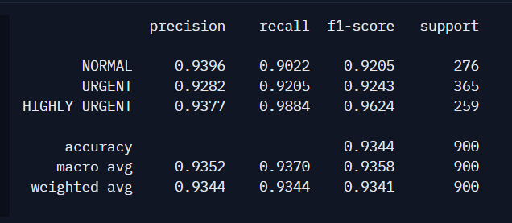
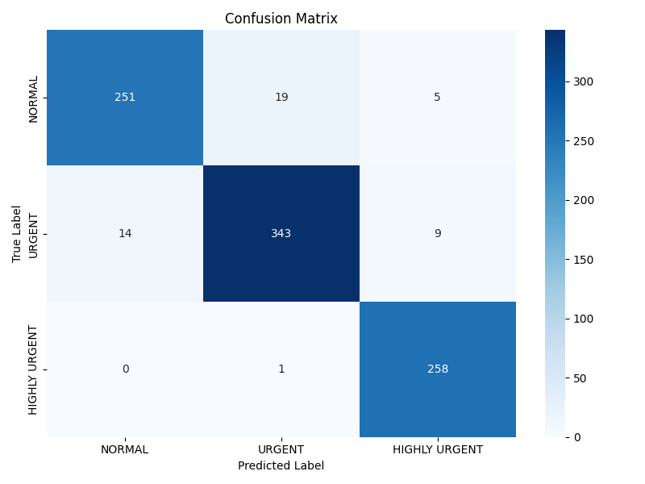
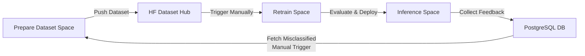
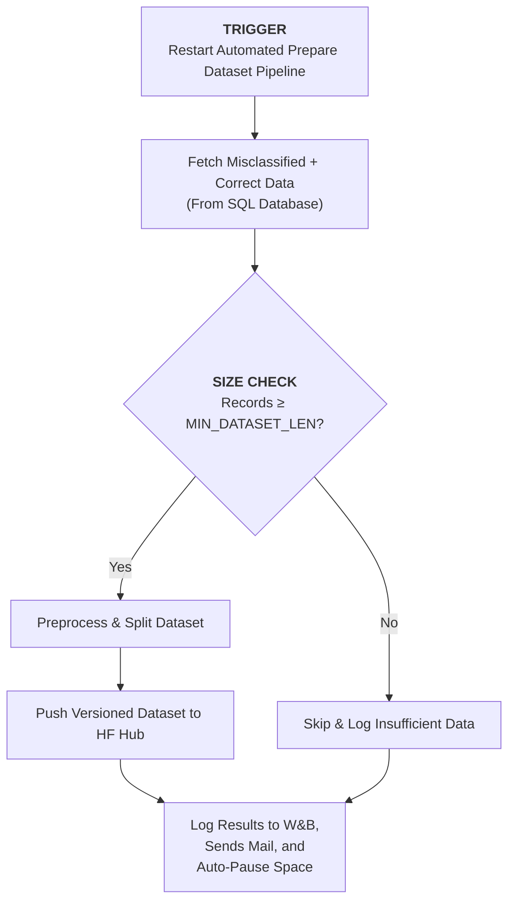
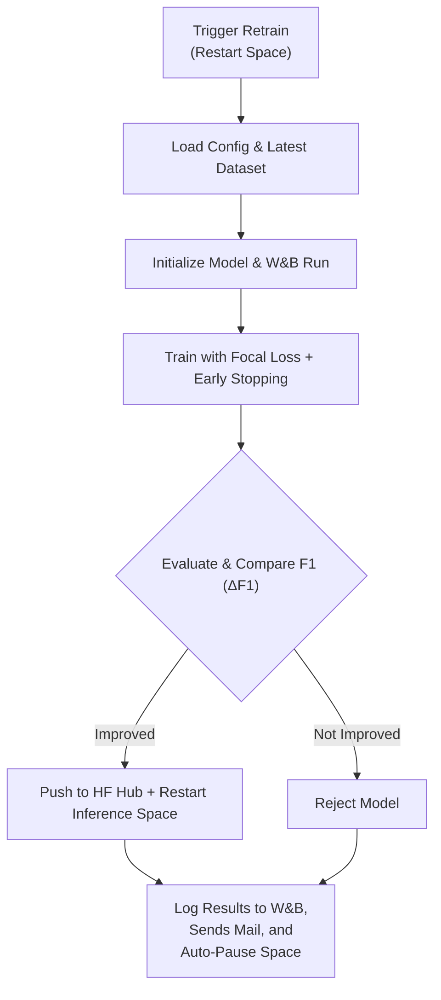

# Sambodhan-AI-Powered-Grievance-Redressal-System-for-Local-Governance


## Overview

Sambodhan is an AI-based system designed to streamline citizen grievance submission, classification, prioritization, and tracking for local governance. It supports multiple submission channels (mobile app, website) and provides real-time tracking, sentiment analysis, and departmental routing.

---

### Table of contents

- [Features](#features)
- [Repository Structure](#repository-structure)
- [Grievance Dataset Schema](#grievance-dataset-schema)
- [Model Overview](#model-overview)
  - [System Architecture](#system-architecture)
  - [1. Department Classification Model](#1-department-classification-model)
    - [Resources](#resources)
    - [Quick Start](#quick-start)
    - [Model Evaluation](#model-evaluation)
  - [2. Urgency Classification Model](#2-urgency-classification-model)
    - [Resources](#resources-1)
    - [Quick Start](#quick-start-1)
    - [Model Evaluation](#model-evaluation-1)
- [Continuous Learning System for Sambodhan AI](#continuous-learning-system-for-sambodhan-ai)
  - [Workflow](#workflow)
  - [Automated Dataset Preparation](#automated-dataset-preparation)
  - [Model Retraining Pipeline](#model-retraining-pipeline)
  - [How Both Pipelines Work Together](#how-both-pipelines-work-together)
<!-- - [Appendices / Resources](#appendices--resources)
  - [Docs folder references](#docs-folder-references)
  - [API / Swagger links](#api--swagger-links) -->


---

## Features
- Multi-channel grievance submission ( app, website)
- Automated grievance classification and departmental routing
- Urgency and sentiment detection
- Admin dashboard for analytics and grievance tracking

---

## Repository Structure

```
├── docs/                     # Project documentation
│   ├── architecture.md       # System architecture, components and high-level diagrams
│   ├── department_classifier.md # Department classifier API, deployment and customization guide
│   ├── grievance_dataset_schema.md # Grievance dataset schema, labels and mappings
│   ├── prepare_dataset.md    # Prepare-dataset HF Space: pipeline, deployment and usage
│   ├── README.md             # Docs index (this file summarizes and links the other docs)
│   ├── retraining_classifier.md # Retraining pipeline architecture, decision gates and runbook
│   └── urgency_classifier.md # Urgency classifier API, deployment and examples
├── data/                     # All project data
│   ├── raw/                  # Original/raw datasets
│   │   ├── csv/              # CSV data files
│   │   └── sql/              # SQL dumps
│   ├── processed/            # Cleaned / preprocessed data
│   └── external/             # External or third-party datasets
├── notebooks/                # Jupyter notebooks for exploration & experimentation
├── orchestrator/             # All CI/CD orchestration logic
│   ├── orchestrator.py       # Main orchestrator script
│   ├── .env_examples         # Example environment variables file
│   ├── requirements.txt      # Orchestrator-specific dependencies
│   └── __init__.py           # makes it a Python package
├── src/                      # Source code
│   ├── __init__.py
│   ├── backend/              # Core backend application
│   │   ├── app/              # FastAPI app entrypoint & routers
│   │   ├── models/           # Database / ORM models
│   │   ├── database/         # DB connections and migrations
│   │   └── utils/            # Backend utility functions
│   ├── frontend/             # Frontend application (Next.js / React)
│   │   ├── components/       # UI components
│   │   ├── pages/            # Frontend pages/routes
│   │   └── assets/           # Static assets (images, css, js)
│   ├── data_science/         # ML/NLP pipelines and experiments
│   │   ├── preprocessing/    # Data cleaning and feature engineering
│   │   ├── models/           # Training scripts / model definitions
│   │   ├── evaluation/       # Model evaluation metrics & plots
│   │   └── utils/            # ML utility functions
│   └── services/             # Standalone classifier microservices
│       ├── department_classifier_api/  # Department classification API
│       ├── prepare_dataset # prepare dataset pipeline
│       ├── retrain_model # retrain model pipeline 
│       └── urgency_classifier_api/     # Urgency classification API
├── tests/                    # Automated tests
│   ├── backend/              # Backend tests
│   ├── frontend/             # Frontend tests
│   └── data_science/         # ML/NLP pipeline tests
├── scripts/                  # Utility scripts for automation
│   └── export/               # Scripts to export or preprocess data
├── requirements.txt          # Python dependencies
├── environment.yml           # Conda environment specification
├── Dockerfile                # Dockerfile for main backend
├── docker-compose.yml        # Docker compose setup for multiple services
├── .gitignore                # Git ignore rules
└── README.md                 # Project overview

```

## Grievance Dataset Schema:

| Column Name   | Data Type      | Description                                                                                             | Example / Allowed Values                                                                                                 |
| ------------- | -------------- | ------------------------------------------------------------------------------------------------------- | ------------------------------------------------------------------------------------------------------------------------ |
| **id**        | Integer/String | Unique identifier for each grievance record.                                                            | 1001                                                                                                                     |
| **grievance** | String         | Text of the citizen grievance describing the issue.                                                     | "Street lights not working in Ward 5."                                                                                   |
| **dept**      | String         | The department or super-department responsible for addressing the grievance.                            | Allowed values:<br>- Municipal Governance & Community Services<br>- Education, Health & Social Welfare <br>- Infrastructure, Utilities & Natural Resources<br>- Security & Law Enforcement |
| **urgency**   | String         | The urgency category of the grievance, based on predefined labels: `normal`, `urgent`, `highly urgent`. | "urgent"                                                                                                                 |

> Detail Dataset Report: [Grievance Dataset Schema](docs/grievance_dataset_schema.md)


---

## Model Overview

### System Architecture

* **Model Type:** Transformer-based text classification `xlm-roberta-base`
* **Framework:** Hugging Face Transformers + PyTorch
* **API Framework:** FastAPI with Pydantic validation
* **Deployment:** Dockerized services on Hugging Face Spaces
* **Core Features:** Batch inference, confidence scoring, automated text preprocessing

---

### 1. Department Classification Model

A production-ready transformer model that classifies citizen grievances into appropriate municipal departments. Deployed as a containerized FastAPI service on Hugging Face Spaces.

#### Resources

| Resource             | Link                                                                                                | Description                                |
| -------------------- | --------------------------------------------------------------------------------------------------- | ------------------------------------------ |
| **Model Repository** | [sambodhan_department_classifier](https://huggingface.co/sambodhan/sambodhan_department_classifier) | Pre-trained weights and configuration      |
| **Live API**         | [Swagger UI](https://sambodhan-department-classifier.hf.space/docs)                                 | Interactive API documentation              |
| **Documentation**    | [Department Classifier Docs](docs/department_classifier.md)                                         | Deployment, usage, and customization guide |

#### Quick Start

```bash
curl -X POST "https://sambodhan-department-classifier.hf.space/predict" \
  -H "Content-Type: application/json" \
  -d '{"text": "Where can I get a new water connection?"}'
```

<<<<<<< HEAD
#### Model Evaluation

**Classification Report**


**Confusion Matrix**


---


### 2. Urgency Classification Model

A transformer-based classifier that determines the urgency level of citizen grievances. Deployed as a containerized FastAPI service on Hugging Face Spaces.

#### Resources

| Resource             | Link                                                                                          | Description                                |
| -------------------- | --------------------------------------------------------------------------------------------- | ------------------------------------------ |
| **Model Repository** | [sambodhan_urgency_classifier](https://huggingface.co/sambodhan/sambodhan_urgency_classifier) | Pre-trained weights and configuration      |
| **Live API**         | [Swagger UI](https://sambodhan-urgency-classifier-space.hf.space/docs)                        | Interactive API documentation              |
| **Documentation**    | [Urgency Classifier Docs](docs/urgency_classifier.md)                                         | Deployment, usage, and customization guide |

#### Quick Start

```bash
curl -X POST "https://sambodhan-urgency-classifier.hf.space/predict_urgency" \
  -H "Content-Type: application/json" \
  -d '{"text": "The water supply in my area has been cut off for 3 days."}'
```

### Model Performance


**Classification Report**


**Confusion Matrix**


---


## Continuous Learning System for Sambodhan AI

Sambodhan AI features a **continuous learning system** that automatically enhances its **Urgency** and **Department** classification models using real-world feedback.

This system consists of two core components:
1. **Automated Dataset Preparation** 
2.  **Model Retraining**

Both are built on **Hugging Face Spaces** and tracked via **Weights & Biases (W&B)**.


### Workflow


> Fig: Continuous Learning Workflow
---

### Automated Dataset Preparation

The **Dataset Preparation Pipeline** automatically gathers, cleans, and publishes new training data for retraining cycles.

#### Key Highlights

* **Event-driven execution** – triggered whenever the **Prepare Dataset Space** restarts (manual or API).
* **Database integration** – fetches **misclassified grievances** and balances them with correctly predicted samples.
* **Data preprocessing** – handles cleaning, encoding, and dataset splitting.
* **Version control** – pushes versioned datasets to the **Hugging Face Dataset Hub** with timestamped tags.
* **Experiment tracking** – logs dataset statistics and push status in **W&B**.
* **Resource-efficient** – the Space auto-pauses after completion to conserve compute.
* **Notify User** - Send Run Summary Email to Admin

#### Components

| Component                 | Role                                        |
| ------------------------- | ------------------------------------------- |
| **Prepare Dataset Space** | Automates data collection and preprocessing |
| **PostgreSQL Database**   | Stores grievances and feedback samples      |
| **HF Dataset Hub**        | Hosts version-controlled training datasets  |
| **Weights & Biases**      | Logs dataset updates and metadata, Notify Admin          |

#### Workflow


> Fig: Dataset Preparation Pipeline

**Detailed Guide:** See **[→ docs/prepare_dataset.md ](docs/prepare_dataset.md)**
 for setup, configuration, and deployment instructions.

---

### Model Retraining Pipeline

The **Retraining Pipeline** ensures Sambodhan’s models continuously improve based on the latest prepared datasets.

#### Key Highlights

* **Automated execution** – runs whenever the **Retrain Space** restarts (manual or API).
* **End-to-end training** – loads the latest dataset, trains using **Focal Loss**, evaluates, and compares results.
* **Performance-based deployment** – deploys a new model **only if** it outperforms the current one (by F1-macro).
* **Containerized runtime** – uses **Dockerized Hugging Face Spaces** that automatically pause after training.
* **Full traceability** – logs metrics, confusion matrices, and deployment decisions to **W&B**.
* **Notify User** - Send Run Summary Email to Admin

#### Components

| Component            | Role                                         |
| -------------------- | -------------------------------------------- |
| **Inference Space**  | Hosts and serves the production model        |
| **Retrain Space**    | Handles training and evaluation runs         |
| **Dataset Hub**      | Stores version-controlled training data      |
| **Model Hub**        | Publishes retrained model versions           |
| **Weights & Biases** | Tracks experiments,Notify Admin,  results, and comparisons |

#### Workflow



> Fig: Model Retraining Pipeline

**Detailed Guide:** 
For complete setup instructions, environment configuration, and architecture diagrams, see: **[→ docs/retraining_classifier.md ](docs/retraining_classifier.md)**

---

### How Both Pipelines Work Together

The **Dataset Preparation Pipeline** feeds new, cleaned, and versioned data into the **Model Retraining Pipeline**.
This ensures that Sambodhan AI continuously learns from real-world feedback, maintains high accuracy, and safely deploys improved models with full traceability and minimal manual intervention.

---


