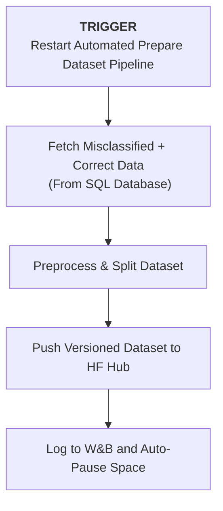
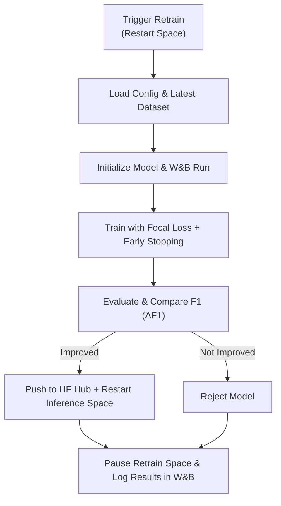

# Sambodhan-AI-Powered-Grievance-Redressal-System-for-Local-Governance


## Overview

Sambodhan is an AI-based system designed to streamline citizen grievance submission, classification, prioritization, and tracking for local governance. It supports multiple submission channels (mobile app, website) and provides real-time tracking, sentiment analysis, and departmental routing.

---

## Features
- Multi-channel grievance submission ( app, website)
- Automated grievance classification and departmental routing
- Urgency and sentiment detection
- Admin dashboard for analytics and grievance tracking

---

## Repository Structure

```
├── docs/                     # Project documentation
│   ├── architecture.md       # System architecture and design
│   ├── api.md                # API specifications and endpoints
│   └── README.md             # General project documentation
├── data/                     # All project data
│   ├── raw/                  # Original/raw datasets
│   │   ├── csv/              # CSV data files
│   │   └── sql/              # SQL dumps
│   ├── processed/            # Cleaned / preprocessed data
│   └── external/             # External or third-party datasets
├── notebooks/                # Jupyter notebooks for exploration & experimentation
├── src/                      # Source code
│   ├── __init__.py
│   ├── backend/              # Core backend application
│   │   ├── app/              # FastAPI app entrypoint & routers
│   │   ├── models/           # Database / ORM models
│   │   ├── database/         # DB connections and migrations
│   │   └── utils/            # Backend utility functions
│   ├── frontend/             # Frontend application (Next.js / React)
│   │   ├── components/       # UI components
│   │   ├── pages/            # Frontend pages/routes
│   │   └── assets/           # Static assets (images, css, js)
│   ├── data_science/         # ML/NLP pipelines and experiments
│   │   ├── preprocessing/    # Data cleaning and feature engineering
│   │   ├── models/           # Training scripts / model definitions
│   │   ├── evaluation/       # Model evaluation metrics & plots
│   │   └── utils/            # ML utility functions
│   └── services/             # Standalone classifier microservices
│       ├── department-classifier/  # Department classification API
│       └── urgency-classifier/     # Urgency classification API
├── tests/                    # Automated tests
│   ├── backend/              # Backend tests
│   ├── frontend/             # Frontend tests
│   └── data_science/         # ML/NLP pipeline tests
├── scripts/                  # Utility scripts for automation
│   ├── export/               # Scripts to export or preprocess data
│   └── dept_classifier/      # Scripts for model training and dataset-prep
├── requirements.txt          # Python dependencies
├── environment.yml           # Conda environment specification
├── Dockerfile                # Dockerfile for main backend
├── docker-compose.yml        # Docker compose setup for multiple services
├── .gitignore                # Git ignore rules
└── README.md                 # Project overview

```

## Grievance Dataset Schema:

| Column Name   | Data Type      | Description                                                                                             | Example / Allowed Values                                                                                                 |
| ------------- | -------------- | ------------------------------------------------------------------------------------------------------- | ------------------------------------------------------------------------------------------------------------------------ |
| **id**        | Integer/String | Unique identifier for each grievance record.                                                            | 1001                                                                                                                     |
| **grievance** | String         | Text of the citizen grievance describing the issue.                                                     | "Street lights not working in Ward 5."                                                                                   |
| **dept**      | String         | The department or super-department responsible for addressing the grievance.                            | Allowed values:<br>- Municipal Governance & Community Services<br>- Education, Health & Social Welfare <br>- Infrastructure, Utilities & Natural Resources<br>- Security & Law Enforcement |
| **urgency**   | String         | The urgency category of the grievance, based on predefined labels: `normal`, `urgent`, `highly urgent`. | "urgent"                                                                                                                 |

> Detail Dataset Report: [Grievance Dataset Schema](docs/grievance_dataset_schema.md)


---

## Department Classification Model

A production-ready transformer-based text classification system for routing citizen grievances to appropriate municipal departments. Deployed as a containerized FastAPI service on HuggingFace Spaces.

### Resources

| Resource | Link | Description |
|----------|------|-------------|
| **Model Repository** | [sambodhan_department_classifier](https://huggingface.co/sambodhan/sambodhan_department_classifier) | Pre-trained model weights and configuration |
| **Live API** | [API Documentation](https://sambodhan-department-classifier.hf.space/docs) | Interactive Swagger UI for testing endpoints |
| **Deployment & Usage** |[Dept Classifier Docs](docs/department_classifier.md) |Refer to this documentation for detailed API usage, deployment instructions,source code,  and customization options.|

### Quick Start
```bash
# Test the live API
curl -X POST "https://sambodhan-department-classifier.hf.space/predict" \
  -H "Content-Type: application/json" \
  -d '{"text": "Where can I get a new water connection?"}'
```

### Model Performance

**Classification Report:**


**Confusion Matrix:**


### Technical Specifications

- **Architecture**: Transformer-based sequence classification
- **Framework**: HuggingFace Transformers + PyTorch
- **API**: FastAPI with Pydantic validation
- **Deployment**: Docker container on HuggingFace Spaces
- **Features**: Batch inference, confidence scoring, automatic text preprocessing

---

## Continuous Learning System for Sambodhan AI

Sambodhan AI features a **continuous learning system** that automatically enhances its **Urgency** and **Department** classification models using real-world feedback.

This system consists of two core components:
1. **Automated Dataset Preparation** 
2.  **Model Retraining**

Both are built on **Hugging Face Spaces** and tracked via **Weights & Biases (W&B)**.

---

### Automated Dataset Preparation

The **Dataset Preparation Pipeline** automatically gathers, cleans, and publishes new training data for retraining cycles.

#### Key Highlights

* **Event-driven execution** – triggered whenever the **Prepare Dataset Space** restarts (manual or API).
* **Database integration** – fetches **misclassified grievances** and balances them with correctly predicted samples.
* **Data preprocessing** – handles cleaning, encoding, and dataset splitting.
* **Version control** – pushes versioned datasets to the **Hugging Face Dataset Hub** with timestamped tags.
* **Experiment tracking** – logs dataset statistics and push status in **W&B**.
* **Resource-efficient** – the Space auto-pauses after completion to conserve compute.

#### Components

| Component                 | Role                                        |
| ------------------------- | ------------------------------------------- |
| **Prepare Dataset Space** | Automates data collection and preprocessing |
| **PostgreSQL Database**   | Stores grievances and feedback samples      |
| **HF Dataset Hub**        | Hosts version-controlled training datasets  |
| **Weights & Biases**      | Logs dataset updates and metadata           |

#### Workflow



**Detailed Guide:** See **[→ docs/prepare_dataset.md ](docs/prepare_dataset.md)**
 for setup, configuration, and deployment instructions.

---

### Model Retraining Pipeline

The **Retraining Pipeline** ensures Sambodhan’s models continuously improve based on the latest prepared datasets.

#### Key Highlights

* **Automated execution** – runs whenever the **Retrain Space** restarts (manual or API).
* **End-to-end training** – loads the latest dataset, trains using **Focal Loss**, evaluates, and compares results.
* **Performance-based deployment** – deploys a new model **only if** it outperforms the current one (by F1-macro).
* **Containerized runtime** – uses **Dockerized Hugging Face Spaces** that automatically pause after training.
* **Full traceability** – logs metrics, confusion matrices, and deployment decisions to **W&B**.

#### Components

| Component            | Role                                         |
| -------------------- | -------------------------------------------- |
| **Inference Space**  | Hosts and serves the production model        |
| **Retrain Space**    | Handles training and evaluation runs         |
| **Dataset Hub**      | Stores version-controlled training data      |
| **Model Hub**        | Publishes retrained model versions           |
| **Weights & Biases** | Tracks experiments, results, and comparisons |

#### Workflow



**Detailed Guide:** 
For complete setup instructions, environment configuration, and architecture diagrams, see: **[→ docs/retraining_classifier.md ](docs/retraining_classifier.md)**

---

### How Both Pipelines Work Together

The **Dataset Preparation Pipeline** feeds new, cleaned, and versioned data into the **Model Retraining Pipeline**.
This ensures that Sambodhan AI continuously learns from real-world feedback, maintains high accuracy, and safely deploys improved models with full traceability and minimal manual intervention.

---


