# Sambodhan: Architecture

> **Sambodhan**: AI-Powered Grievance Redressal System for Local Governance

---

## Table of Contents

1. [Overview](#overview)
2. [System Objectives](#system-objectives)
3. [High-Level Architecture (Mermaid)](#high-level-architecture-mermaid)
4. [System Components](#system-components)

   * [Grievance Submission & Ingestion](#grievance-submission--ingestion)
   * [Model Inference](#model-inference)
   * [Admin Review & Feedback](#admin-review--feedback)
   * [Prepare Dataset Pipeline](#prepare-dataset-pipeline)
   * [Manual Retraining Process](#manual-retraining-process)
5. [Data Model & Contracts](#data-model--contracts)
6. [Deployment Architecture](#deployment-architecture)
7. [Security, Privacy, and Compliance](#security-privacy-and-compliance)
8. [Scalability, Reliability & Observability](#scalability-reliability--observability)
9. [Future Enhancements](#future-enhancements)

---

## Overview

Sambodhan is an AI-powered system designed to streamline grievance management for local governments. Citizens can submit grievances via the **official website**. The system automatically classifies grievances into the appropriate **department** and determines their **urgency** using transformer-based models. Department administrators review these predictions, flag incorrect ones, and such feedback is used to improve the models through **manual retraining cycles**.

This architecture follows a feedback-driven, semi-automated learning loop where both dataset preparation and retraining are manually triggered, ensuring human oversight and transparency in model evolution.

## System Objectives

* Automate routing of citizen grievances to relevant departments.
* Prioritize grievances based on urgency classification.
* Integrate human-in-the-loop corrections for improved model accuracy.
* Maintain a simple, reproducible, and modular ML workflow.
* Ensure traceability and explainability of predictions.

## High-Level Architecture 

```mermaid
    flowchart TD
    %% ==================== STYLES ====================
    classDef citizenStyle fill:#fff9c4,stroke:#fbc02d,stroke-width:2px,font-weight:bold,font-size:14px
    classDef processStyle fill:#e3f2fd,stroke:#1976d2,stroke-width:1px,font-size:13px
    classDef decisionStyle fill:#fff3e0,stroke:#f57c00,stroke-width:2px,font-size:13px
    classDef infraStyle fill:#e8f5e9,stroke:#2e7d32,stroke-width:2px,font-size:13px
    classDef mlStyle fill:#f3e5f5,stroke:#7b1fa2,stroke-width:2px,font-size:13px

    %% ==================== USER ENTRY ====================
    Citizen["CITIZEN<br>Submit grievance via web form"]
    class Citizen citizenStyle

    API["BACKEND API<br>Validates & stores grievance<br>Triggers model inference"]
    class API processStyle

    DB["POSTGRESQL DATABASE<br>Stores grievances, predictions,<br>and admin feedback"]
    class DB infraStyle

    %% ==================== MODEL INFERENCE ====================
    DeptModel["DEPARTMENT CLASSIFIER<br>Predicts responsible department"]
    UrgModel["URGENCY CLASSIFIER<br>Predicts urgency level"]
    class DeptModel,UrgModel mlStyle

    %% ==================== ADMIN FEEDBACK ====================
    Admin["ADMIN DASHBOARD<br>Review predictions<br>Flag incorrect outputs"]
    class Admin processStyle

    Feedback["FEEDBACK TABLE<br>Stores corrected labels<br>for retraining"]
    class Feedback infraStyle

    %% ==================== DATASET PREPARATION ====================
    PrepareSpace["PREPARE DATASET SPACE<br>Manual trigger<br>Fetches flagged samples<br>Cleans, balances, uploads to HF<br> Notify Admin Via Mail"]
    class PrepareSpace mlStyle

    HFDS["HF DATASET HUB<br>Versioned dataset storage"]
    class HFDS infraStyle

    %% ==================== RETRAINING PIPELINE ====================
    RetrainSpace["RETRAIN SPACE<br>Manual trigger<br>Loads dataset<br>Trains & evaluates models"]
    class RetrainSpace mlStyle

    Evaluate["EVALUATE PERFORMANCE<br>Compute metrics (F1, acc, recall)<br>Compare ΔF1 with deployed model"]
    class Evaluate processStyle

    Decision{"DEPLOY?<br>Is performance improved?"}
    class Decision decisionStyle

    Deploy["DEPLOY TO HF MODEL HUB<br>Push new model version<br>Restart inference Space<br> Notify Admin Via Mail"]
    Reject["REJECT MODEL<br>Underperforms<br>Skip deployment<br> Notify Admin Via Mail"]
    class Deploy,Reject processStyle

    HFModel["HF MODEL HUB<br>Stores deployed model versions"]
    class HFModel infraStyle

    InferenceSpace["INFERENCE SPACE<br>Hosts Department & Urgency APIs<br>Used by main backend"]
    class InferenceSpace mlStyle

    %% ==================== FLOW CONNECTIONS ====================
    Citizen --> API
    API --> DB
    API --> DeptModel
    API --> UrgModel
    DeptModel --> DB
    UrgModel --> DB
    DB --> Admin
    Admin -->|Flag incorrect| Feedback
    Feedback -->|Manual trigger| PrepareSpace
    PrepareSpace --> HFDS
    HFDS -->|Manual trigger| RetrainSpace
    RetrainSpace --> Evaluate
    Evaluate --> Decision
    Decision -->|Yes| Deploy
    Decision -->|No| Reject
    Deploy --> HFModel
    HFModel --> InferenceSpace
    InferenceSpace --> API
   

```



---

## System Components

### Grievance Submission & Ingestion

**Responsibility:** Handle grievance submission through the **web portal** and store raw input in the database.

**Workflow:**

1. Citizen fills out the grievance form (text).
2. The backend validates inputs and stores the record.
3. The text content is passed to both the **Department** and **Urgency** classifiers for prediction.

**Stored Fields:**

* `grievance_id`, `citizen_info`, `text`, `timestamp`, `predicted_department`, `predicted_urgency`, `status`.

### Model Inference

**Responsibility:** Predict department and urgency for each grievance.

**Models:**

* **Department Classifier:** Transformer-based text classifier for department routing.
* **Urgency Classifier:** Transformer-based model for urgency level (Low, Medium, High).

**Process:**

1. Upon submission, text is passed to both models.
2. Predictions are stored in the database along with confidence scores.
3. These predictions are visible to the department admin for review.

**Example Output:**

```json
{
  "department": {"label": "Waste Management", "score": 0.91},
  "urgency": {"label": "High", "score": 0.88}
}
```

### Admin Review & Feedback

**Responsibility:** Allow department admins to validate or flag incorrect model predictions.

**Workflow:**

1. Admin reviews model outputs on the dashboard.
2. Incorrect predictions are flagged with the correct label.
3. These flagged records are marked for inclusion in future training datasets.

**Storage:**

* Feedback is stored in a dedicated table containing `grievance_id`, `predicted_label`, `correct_label`, and `review_status`.

### Prepare Dataset Pipeline

**Responsibility:** Aggregate flagged grievances and prepare datasets for retraining.

**Workflow:**

1. Admin triggers dataset preparation manually (Prepare Dataset Space on Hugging Face).
2. The pipeline collects flagged examples from the database.
3. Cleans and formats data into Hugging Face Dataset format.
4. Pushes the prepared dataset to **Hugging Face Dataset Hub** for retraining.

**Output:**

* Updated dataset version ready for manual retraining.

### Manual Retraining Process

**Responsibility:** Improve models using feedback-curated datasets.

**Workflow:**

1. Developer or admin manually triggers model retraining.
2. Uses the latest dataset from Hugging Face Dataset Hub.
3. Retrains Department and Urgency models.
4. Validates model performance.
5. Uploads new models to Hugging Face Model Hub.
6. Updates the inference services with the latest models.

---

## Data Model & Contracts

**Grievance Record Example:**

```json
{
  "id": "uuid",
  "source": "web",
  "received_at": "2025-10-30T12:34:56Z",
  "text": "Garbage not collected in Ward 10 for 3 days",
  "predictions": {
    "department": {"label": "Infrastructure, Utilities & Natural Resources", "score": 0.91},
    "urgency": {"label": "High", "score": 0.88}
  },
  "review_status": "pending|approved|flagged",
  "feedback": {"correct_label": "Municipal Governance & Community Services", "status": "used_for_retraining"}
}
```

## Deployment Architecture

**Setup:**

* All services deployed as Dockerized FastAPI applications.
* Hosted on Hugging Face Spaces.
* Models are fetched from Hugging Face Model Hub.
* Database (Postgres or SQLite) stores grievances and feedback.

**Components:**

* **Frontend:** React-based grievance submission dashboard.
* **Backend:** FastAPI service handling submission, prediction, and review logic.
* **Models:** Department and Urgency models hosted on Hugging Face.

**Deployment Flow:**

1. Retrain model locally.
2. Push updated model to Hugging Face Hub.
3. Update inference service in Hugging Face Space.
4. Validate predictions and monitor performance.

## Security, Privacy, and Compliance

* Store minimal citizen data; anonymize where possible.
* Use HTTPS for all API communications.
* Implement admin role-based authentication.
* Maintain audit trails for all model predictions and feedback edits.

## Scalability, Reliability & Observability

* Docker-based deployment allows horizontal scaling.
* Health checks ensure inference API uptime.
* Basic logging and monitoring for tracking request latency and error rates.

## Future Enhancements

* Automate dataset preparation and retraining (introduce CI/CD pipelines).
* Add multi-channel grievance intake (SMS, mobile app).
* Integrate model explainability for transparency.
* Enable multilingual model support (Nepali + local dialects).


