# Architecture for Model Retraining with Hugging Face Spaces & Docker

This document outlines a production-ready system for continuously improving the Urgency and Department classification models using real-world feedback, leveraging **Hugging Face Spaces** with **Docker** for automated, on-demand CPU and GPU-based model retraining.

---

## Table of Contents

1. [System Overview](#system-overview)
2. [Architecture Components](#architecture-components)
3. [Retraining Pipeline Workflow](#retraining-pipeline-workflow)
4. [Technology Stack](#technology-stack)
5. [Hugging Face Integration Strategy](#hugging-face-integration-strategy)

6. [Implementation Details](#implementation-details)
7. [Deployment Architecture](#deployment-architecture)
8. [Quick Start Guide](#quick-start-guide)
9. [Performance & Cost Analysis](#performance--cost-analysis)

---

## System Overview

### Goals

- **On-Demand Retraining**: Manual trigger via `/retrain` endpoint when sufficient feedback is collected
- **CPU and GPU-Powered**: Use Hugging Face Spaces with Docker for CPU and  GPU-accelerated training
- **Automated Pipeline**: End-to-end workflow from data loading to model deployment
- **Version Control**: Automatic model versioning with timestamp-based tags
- **Cost-Effective**: Pay-per-use GPU compute, automatic space pause after completion
- **Experiment Tracking**: Full integration with Weights & Biases for monitoring

### Current Architecture

Your implementation uses a **dedicated HF Space for retraining** that:
- Runs on-demand when triggered
- Executes complete training pipeline in Docker container
- Automatically deploys improved models
- Pauses itself after completion to save costs

----

```mermaid
flowchart TD
    %% ================== VERTICAL TRAINING PIPELINE ==================
    %% Styling
    classDef titleStyle fill:#c8e6c9,stroke:#388e3c,stroke-width:2px,font-weight:bold,font-size:16px
    classDef processStyle fill:#e3f2fd,stroke:#1976d2,stroke-width:1px,font-size:14px
    classDef decisionStyle fill:#fff3e0,stroke:#f57c00,stroke-width:2px,font-size:14px
    classDef infraStyle fill:#e8f5e9,stroke:#2e7d32,stroke-width:2px,font-size:14px
    
    %% Trigger
    SpaceRestart["<b>TRIGGER</b><br/>HF Space Restarts<br/>Automated pipeline begins"]
    class SpaceRestart infraStyle
    
    %% Config Loading
    LoadConfig["<b>LOAD CONFIGURATION</b><br/>Validate environment variables<br/>Select Department or Urgency model<br/>Load label mappings & hyperparameters"]
    class LoadConfig processStyle
    
    %% Data Loading
    LoadDataset["<b>FETCH DATASET</b><br/>Pull from Hugging Face Hub<br/>Extract train, eval, test splits<br/>Capture version & metadata"]
    class LoadDataset processStyle
    
    %% Initialize Classifier
    InitClassifier["<b>INITIALIZE CLASSIFIER</b><br/>Load pre-trained XLM-RoBERTa<br/>Configure num_labels & label mappings<br/>Authenticate WandB for logging"]
    class InitClassifier processStyle
    
    %% Training
    TrainModel["<b>TRAIN MODEL</b><br/>Tokenize all dataset splits<br/>Apply Focal Loss for class imbalance<br/>Use early stopping on validation F1<br/>Track metrics during training"]
    class TrainModel processStyle
    
    %% Evaluation
    Evaluate["<b>EVALUATE PERFORMANCE</b><br/>Run predictions on test set<br/>Compute F1, accuracy, precision, recall<br/>Query deployed model via API<br/>Calculate performance delta ΔF1"]
    class Evaluate processStyle
    
    %% Logging
    LogWandB["<b>LOG METRICS</b><br/>Upload classification report to WandB<br/>Generate confusion matrix visualization<br/>Record training arguments<br/>Store dataset & model metadata"]
    class LogWandB processStyle
    
    %% Decision
    Decision{"<b>DECISION GATE</b><br/>Is new model F1<br/>better than deployed<br/>by threshold?"}
    class Decision decisionStyle
    
    %% Deployment
    Deploy["<b>DEPLOY MODEL</b><br/>Push model & tokenizer to HF Hub<br/>Create version tag with timestamp<br/>Upload metadata.json<br/>Restart target inference Space"]
    class Deploy processStyle
    
    Reject["<b>REJECT MODEL</b><br/>New model underperforms<br/>Skip deployment<br/>Log rejection reason"]
    class Reject processStyle
    
    %% Pause Space
    PauseSpace["<b>SHUTDOWN</b>
    Send Run Summary Mail<br/>Pause retrain Space<br/>Free compute resources<br/>Pipeline complete"]
    class PauseSpace infraStyle
    
    %% ------------------ FLOW ------------------
    SpaceRestart --> LoadConfig
    LoadConfig --> LoadDataset
    LoadDataset --> InitClassifier
    InitClassifier --> TrainModel
    TrainModel --> Evaluate
    Evaluate --> LogWandB
    LogWandB --> Decision
    Decision -->|Accepted| Deploy
    Decision -->|Rejected| Reject
    Deploy --> PauseSpace
    Reject --> PauseSpace
```



> Fig: Retraining Pipeline 

---

## Architecture Components

### 1. Seperate Inference Space (Production)
- **Purpose**: Serve real-time predictions via API
- **Model**: Deployed XLM-RoBERTa fine-tuned model
- **Endpoints**: `/predict` for urgency/department classification
- **State**: Always running (or auto-scaled)

### 2. Retrain Space (Training)
- **Purpose**: Automated model retraining pipeline
- **Trigger**: Manual via `/retrain` endpoint or scheduled
- **Runtime**: Docker container with Python 3.12
- **State**: Paused when idle, active only during training
- **Output**: New model version pushed to HF Hub

### 3. Dataset Hub
- **Purpose**: Version-controlled training data storage
- **Format**: HuggingFace Dataset with train/eval/test splits
- **Updates**: Manual uploads with updated feedback data
- **Metadata**: Includes version tags, split sizes, timestamps

### 4. Model Hub
- **Purpose**: Model versioning and artifact storage
- **Versions**: Tagged with timestamps (e.g., `v20250129_143052`)
- **Artifacts**: Model weights, tokenizer, metadata.json
- **Deployment**: Inference Space pulls latest version

### 5. Weights & Biases
- **Purpose**: Experiment tracking and model comparison
- **Logged Data**: 
  - Training metrics (loss, F1, accuracy)
  - Classification reports
  - Confusion matrices
  - Dataset metadata
  - Deployment decisions
- **Projects**: Separate for urgency and department models

---

## Retraining Pipeline Workflow

### Complete End-to-End Process

#### **1. TRIGGER**
- User or scheduler initiates `/retrain` endpoint
- HF Retrain Space receives restart signal
- Docker container begins building

#### **2. CONTAINERIZATION**
- Install dependencies from `requirements.txt`
- Set up non-root user environment
- Configure HF cache directories
- Execute entry point: `python train_model.py`

#### **3. LOAD CONFIGURATION**
- Validate all environment variables
- Select model type based on `LABEL` env var
- Load appropriate label mappings
- Configure hyperparameters

#### **4. FETCH DATASET**
- Pull dataset from HF Hub using token
- Extract train, eval, test splits
- Capture metadata: version tag, split sizes
- Validate data integrity

#### **5. INITIALIZE CLASSIFIER**
- Load XLM-RoBERTa tokenizer and model
- Configure label mappings and num_labels
- Authenticate Weights & Biases
- Initialize WandB run with metadata

#### **6. TRAIN MODEL**
- Tokenize all dataset splits
- Apply FocalLossTrainer with custom loss
- Train with early stopping (patience=1)
- Monitor validation F1 macro every 50 steps
- Save best checkpoint

#### **7. EVALUATE PERFORMANCE**
- Run predictions on test set
- Compute metrics: F1, accuracy, precision, recall
- Generate classification report
- Create confusion matrix
- Query deployed model API (300 samples)
- Calculate ΔF1 between new and deployed

#### **8. LOG METRICS**
- Upload classification report table to WandB
- Generate confusion matrix heatmap
- Log training arguments
- Record dataset metadata
- Store deployment decision

#### **9. DECISION GATE**
- Compare: `new_f1_macro > deployed_f1_macro + 0.001`
- **If True**: Proceed to deployment
- **If False**: Reject and skip deployment
- Log decision reasoning to WandB

#### **10. DEPLOY MODEL** (if accepted)
- Push model weights to HF Hub
- Push tokenizer configuration
- Create timestamp-based version tag
- Upload `metadata.json` with:
  - Training arguments
  - Evaluation metrics
  - Commit message
  - Author and timestamp
- Trigger Inference Space restart
- Wait for deployment confirmation

#### **11. SHUTDOWN**
- Finish WandB run
- Pause Retrain Space (free resources)
- Log completion status
- Pipeline complete
---

## Technology Stack

### Retraining Pipeline

**Core Framework:**
- Python 3.12
- Transformers (Hugging Face)
- PyTorch with Focal Loss
- XLM-RoBERTa base model

**Key Files:**
- `train_model.py` - Main orchestrator
- `model_pipeline.py` - GrievanceClassifier with training logic
- `load_dataset.py` - HF Dataset Hub integration
- `configs.py` - Environment-based configuration

**Docker Setup:**
- Base: `python:3.12-slim`
- Non-root user for security
- Cached HF artifacts in `/home/user/app/hf_cache`
- Requirements: transformers, torch, datasets, wandb, scikit-learn

### Configuration System

**Environment Variables:**
```bash
# Hugging Face
HF_TOKEN=<write_access_token>
MODEL_CHECKPOINT=xlm-roberta-base
DATASET_REPO_ID=<username>/sambodhan-dataset
HUB_MODEL_ID=<username>/sambodhan-urgency-classifier
API_ENDPOINT=https://inference-space.hf.space/predict
SPACE_REPO_ID=<username>/sambodhan-inference
RETRAIN_SPACE_ID=<username>/sambodhan-retrain

# Model Selection
LABEL=urgency  # or 'department'

# Weights & Biases
WANDB_API_KEY=<wandb_key>
WANDB_PROJECT_NAME=sambodhan-urgency-classifier

# Training Hyperparameters
EARLY_STOPPING_PATIENCE=1
DEPLOYED_SAMPLE_SIZE=300
DECISION_THRESHOLD=0.001
```

**Label Mappings:**

**Department Classification:**
```python
department2id = {
    'Municipal Governance & Community Services': 0,
    'Education, Health & Social Welfare': 1,
    'Infrastructure, Utilities & Natural Resources': 2,
    'Security & Law Enforcement': 3
}
```

**Urgency Classification:**
```python
urgency2id = {
    'NORMAL': 0, 
    'URGENT': 1, 
    'HIGHLY URGENT': 2
}
```

### Model Training

**FocalLossTrainer:**
- Custom Hugging Face Trainer
- Implements Focal Loss for class imbalance
- Parameters: `gamma=2.0`, `alpha=0.25`
- Early stopping on F1 macro score

**Training Arguments:**
- Epochs: 3 (with early stopping)
- Batch size: 16 (train), 32 (eval)
- Learning rate: 2e-5
- Weight decay: 0.01
- FP16 precision: Enabled
- Evaluation strategy: Every 50 steps
- Metric for best model: F1 macro

---

## Hugging Face Integration Strategy

### Current Setup

**Inference Space:**
- Hosts deployed model for real-time predictions
- Exposes `/predict` API endpoint
- Automatically loads latest model from HF Hub
- Restarts when new model is pushed

**Retrain Space:**
- Dockerized training pipeline
- Triggered manually or via API
- Runs complete training workflow
- Auto-pauses after completion

**Dataset Hub:**
- Stores versioned training data
- Public or private repository
- Includes metadata: splits, version tag, size

**Model Hub:**
- Version-controlled model storage
- Automatic tagging (timestamp-based)
- Metadata file with training details
- Direct integration with Inference Space

### Decision Logic

**Model Acceptance Criteria:**
1. Train new model on latest dataset
2. Evaluate on test set (compute F1 macro)
3. Query deployed model API with same test samples
4. Calculate performance delta: `ΔF1 = new_f1 - deployed_f1`
5. **Accept** if `ΔF1 > threshold` (default: 0.001)
6. **Reject** otherwise (no deployment)

**Deployment Process (if accepted):**
1. Push model + tokenizer to HF Hub
2. Create version tag (e.g., `v20250129_143052`)
3. Upload `metadata.json` with training details
4. Trigger Inference Space restart
5. Log deployment to WandB
6. Pause Retrain Space


---

## Implementation Details

### Key Classes & Functions

#### **GrievanceClassifier** (`model_pipeline.py`)

**Initialization:**
```python
classifier = GrievanceClassifier(
    model_checkpoint="xlm-roberta-base",
    num_labels=3,  # or 4 for department
    id2label=id2urgency,
    label2id=urgency2id,
    hf_token=HF_TOKEN,
    wandb_api_key=WANDB_API_KEY,
    wandb_project_name=WANDB_PROJECT_NAME
)
```

**Core Methods:**
- `tokenize_dataset()` - Tokenizes HF Dataset
- `train()` - Trains model with FocalLossTrainer
- `evaluate()` - Evaluates and compares with deployed model
- `log_wandb_eval_metrics()` - Logs metrics to WandB
- `push_model_to_hub()` - Deploys model to HF Hub
- `restart_space()` - Restarts Inference Space
- `train_pipeline()` - Orchestrates complete workflow

#### **FocalLossTrainer** (Custom Trainer)

**Purpose:** Handle class imbalance in grievance data

**Implementation:**
```python
class FocalLossTrainer(Trainer):
    def compute_loss(self, model, inputs, return_outputs=False):
        labels = inputs.get("labels")
        outputs = model(**inputs)
        logits = outputs.get("logits")
        loss_fct = FocalLossMultiClass(gamma=2.0, alpha=0.25)
        loss = loss_fct(logits, labels)
        return (loss, outputs) if return_outputs else loss
```

#### **Configuration System** (`configs.py`)

**Dynamic Config Selection:**
- Reads `LABEL` environment variable
- Returns `DepartmentConfig` or `UrgencyConfig`
- Validates all required secrets
- Strips whitespace from string values

**Config Classes:**
- `BaseConfig` - Common fields and validation
- `DepartmentConfig` - 4-class classification
- `UrgencyConfig` - 3-class classification

#### **Dataset Loader** (`load_dataset.py`)

**Features:**
- Secure token-based authentication
- Metadata extraction (version, splits, size)
- Latest tag detection
- Error handling and validation

---

## Deployment Architecture

### HF Spaces Structure

**Inference Space** (Always Running)

> See the Inference Docs in Readme.md

```
sambodhan-inference/
├── app.py              # FastAPI application
├── requirements.txt
├── Dockerfile
└── README.md
```

**Retrain Space** (On-Demand)
```
src/services/retrain_model/
├── train_model.py      # Main entry point
├── model_pipeline.py   # Training logic
├── load_dataset.py     # Data loading
├── configs.py          # Configuration
├── requirements.txt
├── Dockerfile
└── README.md
```

### Docker Configuration

**Dockerfile for Retrain Space:**
```dockerfile
FROM python:3.12-slim

RUN useradd -m -u 1000 user
USER user

ENV HOME=/home/user \
    PATH="/home/user/.local/bin:$PATH"

WORKDIR /home/user/app

COPY --chown=user requirements.txt .
RUN pip install --upgrade pip && \
    pip install --no-cache-dir -r requirements.txt

ENV HF_HOME=/home/user/app/hf_cache \
    HF_DATASETS_CACHE=/home/user/app/hf_cache

RUN mkdir -p /home/user/app/hf_cache && \
    chmod -R 777 /home/user/app/hf_cache

COPY --chown=user . .

EXPOSE 7860

CMD ["python", "train_model.py"]
```

**Key Features:**
- Non-root user for security
- Cached HF artifacts
- Slim base image
- Automatic dependency installation

### Version Control Strategy

**Model Versioning:**
- Format: `v{YYYYMMDD}_{HHMMSS}`
- Example: `v20250129_143052`
- Stored as Git tags on HF Hub
- Immutable once created

**Metadata Tracking:**
```json
{
  "model_name": "sambodhan-urgency-classifier",
  "version_tag": "v20250129_143052",
  "commit_message": "Auto-deploy: ΔF1 >= 0.0010",
  "timestamp_utc": "20250129_143052",
  "author": "mr-kush",
  "training_args": { /* sanitized args */ },
  "eval_metrics": { /* classification report */ }
}
```

---

## Quick Start Guide

### Prerequisites

1. **Hugging Face Account**: https://huggingface.co/join
2. **HF Write Token**: Settings → Access Tokens → New token (write)
3. **WandB Account**: https://wandb.ai/signup
4. **WandB API Key**: Settings → API keys

### Step 1: Prepare Dataset

**Upload to HF Dataset Hub:**

#### Automated :

```python

from hugging_face import Hfapi

api = Hfapi()


api.restart_space(
       repo_id= 'sambodhan/prepare_dataset'
       token='your_hf_token'
)

```

#### Manual:

```python
from datasets import Dataset, DatasetDict

# Prepare your data
train_data = {"grievance": [...], "label": [...]}
eval_data = {"grievance": [...], "label": [...]}
test_data = {"grievance": [...], "label": [...]}

# Create DatasetDict
dataset = DatasetDict({
    "train": Dataset.from_dict(train_data),
    "eval": Dataset.from_dict(eval_data),
    "test": Dataset.from_dict(test_data)
})

# Push to Hub
dataset.push_to_hub("your-username/sambodhan-dataset", token=HF_TOKEN)
```


### Step 2: Create Inference Space

**Create new Space on HF:**
1. Go to https://huggingface.co/new-space
2. Choose "Docker" as SDK
3. Select GPU: None (CPU inference)
4. Upload your inference code
5. Set environment variable: `HF_TOKEN`
6. Deploy and note the Space URL

### Step 3: Create Retrain Space

**Clone this repository structure:**

#### 1. Urgency Classifier Retraining Space
```bash
git clone https://huggingface.co/spaces/sambodhan/urgency-classifier-retraining
cd sambodhan-retrain
```

#### 2. Department Classifier Retraining Space

```bash
git clone https://huggingface.co/spaces/sambodhan/urgency-classifier-retraining
cd sambodhan-retrain
```

**Add files:**
- `train_model.py`
- `model_pipeline.py`
- `load_dataset.py`
- `configs.py`
- `requirements.txt`
- `Dockerfile`

**Set Space Secrets:**
```
HF_TOKEN=<your_write_token>
MODEL_CHECKPOINT=xlm-roberta-base
DATASET_REPO_ID=your-username/sambodhan-dataset
HUB_MODEL_ID=your-username/sambodhan-urgency-classifier
API_ENDPOINT=https://your-inference-space.hf.space/predict
SPACE_REPO_ID=your-username/sambodhan-inference
RETRAIN_SPACE_ID=your-username/sambodhan-retrain
LABEL=urgency
WANDB_API_KEY=<your_wandb_key>
WANDB_PROJECT_NAME=sambodhan-urgency-classifier
EARLY_STOPPING_PATIENCE=1
DEPLOYED_SAMPLE_SIZE=300
DECISION_THRESHOLD=0.001
```

**Push to Hub:**
```bash
git add .
git commit -m "Initial retrain space setup"
git push
```

### Step 4: Trigger First Training

**Manual Trigger:**
1. Go to your Retrain Space
2. Click "Restart Space"
3. Monitor logs in real-time
4. Check WandB for training metrics

**Programmatic Trigger:**
```python
from huggingface_hub import HfApi

api = HfApi()
api.restart_space(
    repo_id="your-username/sambodhan-retrain",
    token=HF_TOKEN
)
```

### Step 5: Monitor Progress

**Check Logs:**
- View Space logs in real-time
- Look for status messages with timestamps
- Monitor training progress

**WandB Dashboard:**
- Open your WandB project
- View training curves
- Check classification reports
- Analyze confusion matrices

**Model Hub:**
- Check for new version tags
- Review metadata.json
- Verify model artifacts

### Step 6: Verify Deployment

**Test Inference Space:**
```python
import requests

response = requests.post(
    "https://your-inference-space.hf.space/predict",
    json={"text": "सडक बिग्रेको छ"}
)
print(response.json())
```

**Expected Response:**
```json
{
  "label": "NORMAL",
  "confidence": 0.3543,
  "scores": {
    "NORMAL": 0.3543,
    "URGENT": 0.3499,
    "HIGHLY URGENT": 0.2958
  }
}
```


---

## Monitoring & Metrics

### WandB Integration

**Logged Metrics:**
- Training loss per epoch
- Validation F1 macro
- Accuracy, precision, recall
- Classification report (per-class metrics)
- Confusion matrix visualization
- Dataset metadata
- Training hyperparameters
- Model comparison (new vs deployed)
- Deployment decision and reasoning

**Dashboard Views:**
- Training curves over time
- Model performance comparison
- Dataset evolution tracking
- Deployment history

### System Health Monitoring

**Key Indicators:**
- Space status (running/paused)
- Training job success/failure rate
- Deployment acceptance rate
- Average training time
- Model performance trends

**Alerting:**
- Training failures
- Deployment rejections
- Performance degradation
- Space restart issues

---

## Troubleshooting

### Common Issues

**1. Training Fails to Start**
- Check HF_TOKEN has write access
- Verify all environment variables are set
- Check dataset repository exists and is accessible
- Review Docker build logs

**2. Model Not Deploying**
- Verify ΔF1 meets threshold
- Check HF Hub authentication
- Ensure Space restart permissions
- Review deployment logs in WandB

**3. WandB Login Fails**
- Verify WANDB_API_KEY is correct
- Check internet connectivity from Space
- Ensure WandB project exists

**4. Space Won't Pause**
- Check RETRAIN_SPACE_ID is correct
- Verify token has Space management permissions
- Review pause command logs


## Future Enhancements

### Phase 1: Current Implementation 
- [x] Docker-based training pipeline
- [x] Automatic model deployment
- [x] Version control with tags
- [x] WandB integration
- [x] Focal Loss for imbalance
- [x] Comparison with deployed model
- [x] Auto-pause after completion
- [x] Automated dataset updates from feedback

### Phase 2: Next 3 Months
- [ ] Scheduled retraining (cron-based)
- [ ] A/B testing framework
- [ ] Model performance monitoring dashboard
- [ ] Slack/email notifications for deployments
- [ ] Rollback mechanism for bad deployments

### Phase 3: 6-12 Months
- [ ] Active learning pipeline
- [ ] Ensemble model support
- [ ] Multi-language expansion
- [ ] Real-time retraining triggers
- [ ] Custom hyperparameter tuning with Optuna
- [ ] Model compression and quantization

### Phase 4: Long-term
- [ ] Federated learning setup
- [ ] Edge deployment for offline use
- [ ] Custom Nepali embeddings
- [ ] Multi-task learning (urgency + department joint training)

---


## Security Considerations

### Token Management
- Use HF tokens with minimum required permissions
- Rotate tokens regularly (quarterly)
- Never commit tokens to git
- Use HF Spaces secrets, not environment files

### Data Privacy
- Ensure training data complies with privacy policies
- Use private repositories for sensitive data
- Implement data anonymization if needed
- Regular security audits of dataset access

### Model Security
- Validate inputs to prevent adversarial attacks
- Monitor for model drift and degradation
- Implement rate limiting on inference API
- Log all predictions for audit trails

---

## Conclusion

This  implementation provides a **robust, cost-effective, and scalable** solution for continuous model improvement. The key advantages are:

1. **Simplicity**: Single command to trigger retraining
2. **Cost-Effective**: ~$1-10/month for typical usage
3. **Automated**: End-to-end pipeline with minimal intervention
4. **Quality**: GPU-accelerated training with experiment tracking
5. **Safe**: Decision logic prevents deploying worse models

This architecture is production-ready and can scale from prototype to thousands of daily predictions with minimal changes.


###  Project Links
- Hugging Face Org:`https://huggingface.co/sambodhan`
`
---

**Document Version**: 2.0  
**Last Updated**: October 29, 2025  
**Author**: Based on implementation by @kushalregmi61
**Status**: Production-Ready ✅